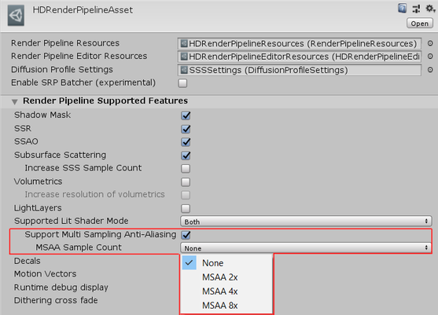

Multisampling anti-aliasing in HDRP

[Aliasing]() is a side effect that appears when a digital sampler samples real-world information and attempts to digitize it. For example, when sampling audio or video, this causes the shape of the digital signal to not match the shape of the original signal. This is most obvious when comparing the original and digital signals for an audio source at its highest frequencies, or a visual source in its smallest details. Regular signal processing uses the [Nyquist rate]() to avoid this pattern, however it is not practical for image rendering due to it being very resource intensive.

An example of the rasterization process creating some aliasing.

To limit this side effect, HDRP supports multisampling anti-aliasing (MSAA), [temporal anti-aliasing (TAA)]() and [fast approximate anti-aliasing (FXAA)](). MSAA is better at solving aliasing issues than the other techniques, but it is much more intrusive and more expensive. Crucially, MSAA solves [spatial aliasing]() issues.

To enable MSAA in your HDRP project, open your [HDRP Asset](HDRP-Asset) and, in the **Render Pipeline Supported Features** section enable the **Support Multi Sampling Anti-Aliasing** checkbox . If this option is grayed-out, set the **Supported Lit Shader Mode** to either **Both** or **Forward Only**. This is necessary because HDRP only supports MSAA for forward rendering. After you enable support for MSAA, you can select an **MSAA Sample Count** from the drop-down menu (**None, 2X, 4X, 8X**). This defines how many samples HDRP computes per pixel for evaluating the effect. 

When using MSAA, be aware of the following:

1. Increasing the sample count makes the MSAA effect more resource intensive. 
2. If you enable support for MSAA but set the **MSAA Sample Count** to **None**, HDRP allocates resources for MSAA which negatively affects the render pipeline without any anti-aliasing benefit.
3. **Screen space reflection (SSR)** is currently incompatible with MSAA.

When you enable MSAA for your Unity Project, you must then enable it on all Cameras using the [Frame Settings](<https://github.com/Unity-Technologies/ScriptableRenderPipeline/wiki/Frame-Settings>). You can do this either globally, by enabling it in the **Default Frame Settings** of your **HDRP Asset**, or individually for each Camera.

To enable MSAA globally on all Cameras:

1. Open your HDRP Asset and navigate to the **Default Frame Settings For** section. 
2. Make sure that the **Default Frame Settings For** drop-down is set to **Camera**. 
3. Open the **Rendering Settings** drop-down menu and set the **Lit Shader Mode** to **Forward**, because HDRP only supports MSAA for forward rendering. 
4. Enable the **MSAA** checkbox to enable MSAA by default for all Cameras.

To enable MSAA on each Camera:

1.  Click on a GameObject with an attached Camera component to open it in the Inspector. 
2. In the Camera component’s **General** section, set the **Rendering Path** to **Custom**. This exposes the **Frame Settings Override** section. 
3. Open the **Rendering Settings** drop-down menu and set the **Lit Shader Mode** to **Forward**, because HDRP only supports MSAA for forward rendering. 
4. Tick the **MSAA** checkbox to enable MSAA for this Camera.

Increasing the MSAA Sample Count produces smoother antialiasing, at the cost of performance. Here are some visual examples showing the effect of the different **MSAA Sample Counts**:

**MSAA Sample Count** set to **None**.

**MSAA Sample Count** set to **MSAA 2X**.

**MSAA Sample Count** set to **MSAA 4X**.

**MSAA Sample Count** set to **MSAA 8X**.