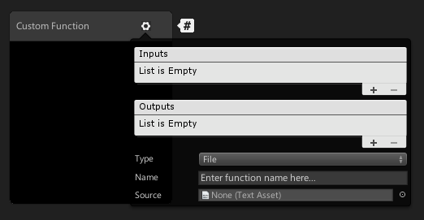
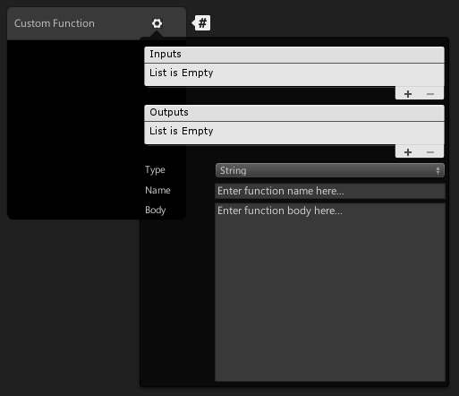
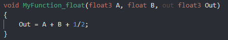

# Custom Function Node

## Description

[Shader Graph](Shader-Graph.md) makes it easier than ever to author custom shaders inside of Unity. However, our default [Nodes](Node.md) can't possibly cover everything you want to make. To support this, we offer a Custom Function node inside of our [Node Library](Node-Library.md) that ships with the package. 

Our Custom Function node lets you inject your own custom HLSL code inside of shader graphs. You can either write small functions directly into the graph using the `string` mode, or reference outside HLSL include files. You can also use the [Custom Port Menu](Custom-Port-Menu.md) to define your own input and output ports on the node itself. 

## How to Use
Custom Function nodes can be created using the [Create Node Menu](Create-Node-Menu.md). By default, new Custom Function nodes are created without any input or output ports. 

Use the cog icon in the top right corner of the node to open the [Custom Port Menu](Custom-Port-Menu.md) and Custom Function Menu.

 

### Custom Function Menu

| Menu Item | Description |
|:----------|:------------|
| Inputs | A [Custom Port Menu](Custom-Port-Menu.md) that defines the input ports of the node. |
| Outputs | A [Custom Port Menu](Custom-Port-Menu.md) that defines the output ports of the node. |
| Type | A drop down menu to set the type of function. Options are `File` to reference an outside file, or `string` to directly input functions into the node. |
| Name | Defines the name of the custom function in the final generated code. |
| Source | An asset field to reference the outside HLSL include file. **Only available in `File` mode**. |
| Body | A text box to enter HLSL code. **Only available in `String` mode**. |

### Defining the Function via String 
When using `String` type, the shader function is generated by the graph. The `Name` field defines the name of the generated function and the `Body` field defines the contents of the generated function. Arguments, braces, and indent scope are handled automatically.

The example above generates the following function:

### Defining the Function via File 
When using `File` type, the shader function is not automatically generated. `File` type simply injects an include reference into the final generated shader and uses a function from inside of the referenced file. The `Name` field must match the name of the function you are trying to call. The `Source` field contains a reference to the HLSL file that contains that function. 

Using `File` type for the Custom Function node means that you need to format your functions properly by hand. One thing to note when creating custom functions for [Shader Graph](Shader-Graph.md) is the precision suffixes. The generated code appends a precision suffix to function names. Your include file function will need to also append your desired precision suffix (shown below with `float`), but your `Name` field **should not include the precision suffix**. 

`File` mode can allow for more flexbility with custom functions inside of the graph. You can define uniform variables outside of the function scope, shown here with a matrix.

You can define multiple functions inside of the same file and call them from your referenced function. Or, you can reference the same file but different functions from different Custom Function nodes. 

You can even include other files that contain other functions, and so on. 

### Reusing Custom Function Nodes 
The Custom Function node on its own is a single node instance. If you wish to re-use the same custom functions without re-creating the inputs, outputs, and function referencing you can use [Sub Graphs](Sub-graph.md). Sub Graphs will show up in the [Create Node Menu](Create-Node-Menu.md) and allow you to share or re-use your custom functions. 

You can either create your custom function directly inside of a Sub Graph, or you can right click the existing custom function node and select `Convert to Sub Graph`. Add the appropriate input and output ports via the [Blackboard](Blackboard.md) and [Custom Port Menu](Custom-Port-Menu.md). Now your custom function can be reused as many times as needed, even within other Sub Graph. 