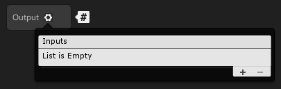
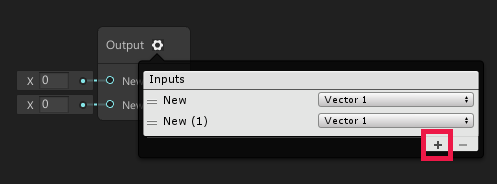
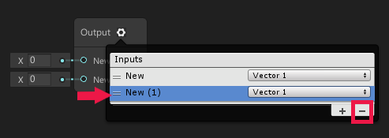
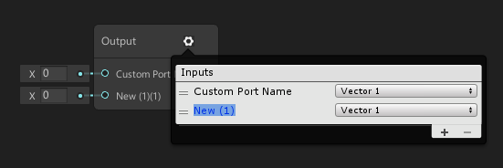
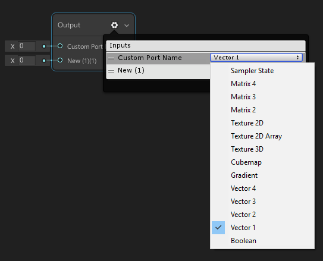

# Custom Port Menu

## Description 
The Custom [Port](Port.md) Menu is available on the [Custom Function Node](Custom-Function-Node.md) and [Sub Graph](Sub-graph.md) output node. This menu allows you to add, remove, rename, reorder, and define the type of your own custom input and/or output ports. 

## How to Use 
This menu can be accessed by clicking the cog icon on the top right corner of the node. This will open the Custom Port Menu on top of the node. To close the menu, click the cog icon again. Opening the menu via the cog icon will automatically deselect any current selections and select the current node the menu is attached to.

### Adding and Removing Ports
Ports can be added by using the `+` icon at the bottom right corner of the port list. 

Ports can be removed by selecting the port using the hamburger icon to the left of the text and clicking the `-` icon at the bottom right corner of the port list.

### Renaming Ports
Ports can be renamed by double clicking on the text field. Currently, ports can only accept the following characters as valid input: A-Z, a-z, 0-9, _, ( ), and whitespace. If you have an invalid character in your slot names, you will see an error badge.

### Reordering Ports
Ports can be reordered by grabbing the hamburger icon to the left of the text and dragging the port to your desired place in the list.

### Changing Port Types
Port types can be changed using the Type drop down menu to the right of the text field. Current valid port types can be found at the [Data Types](Data-Types.md) page. 

